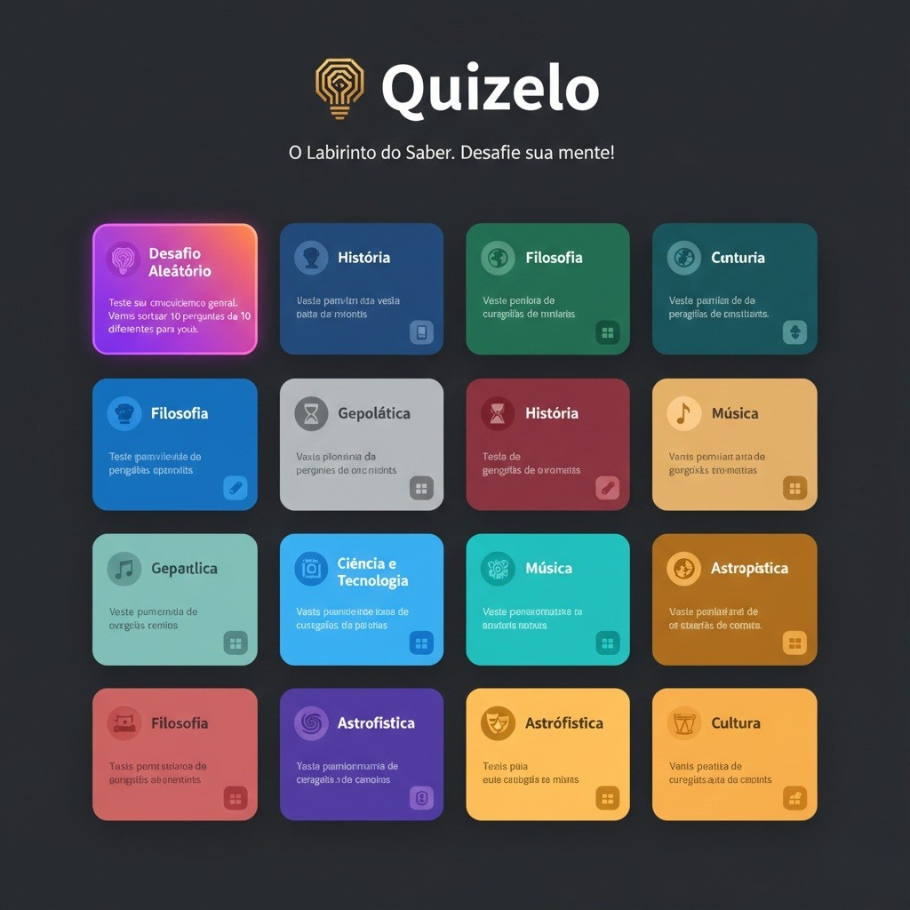
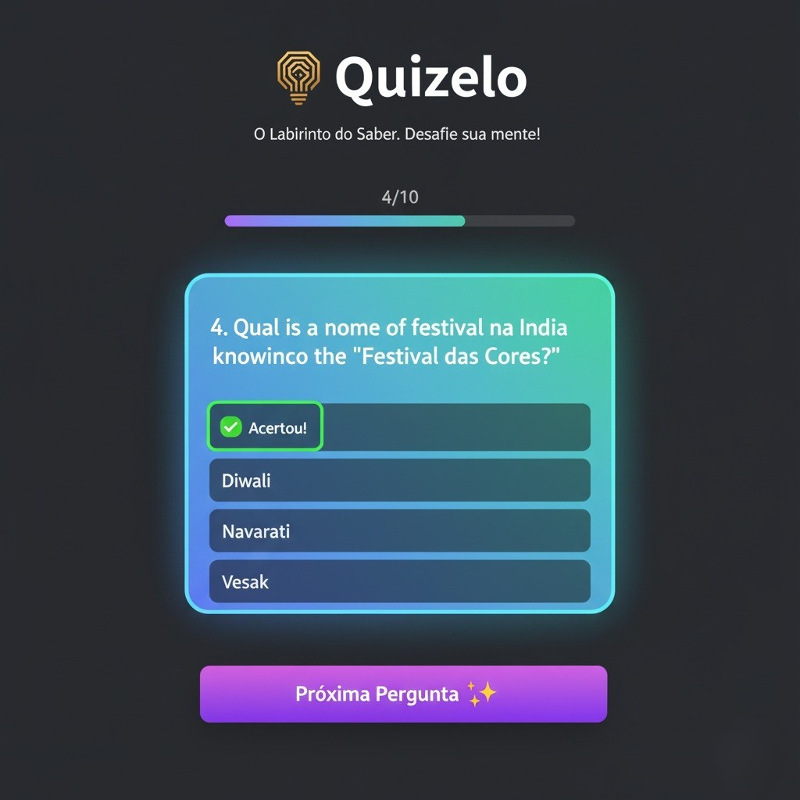
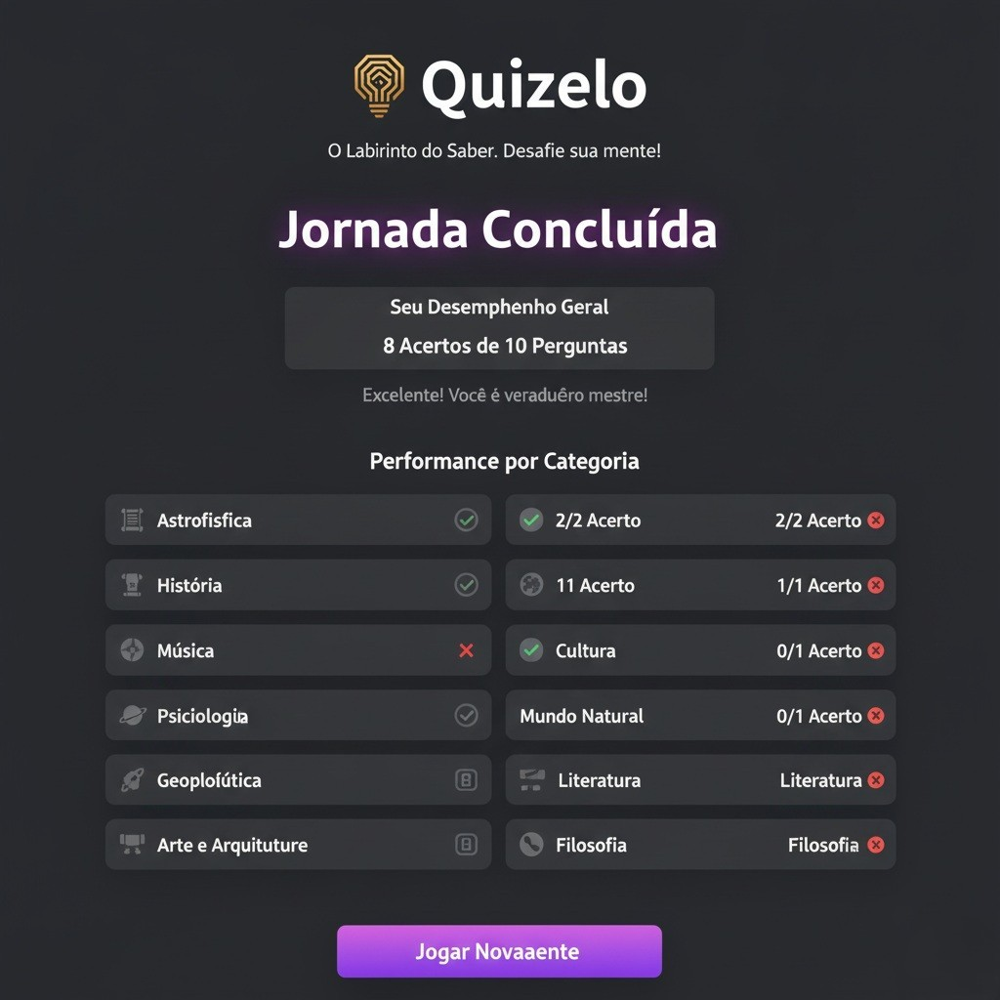
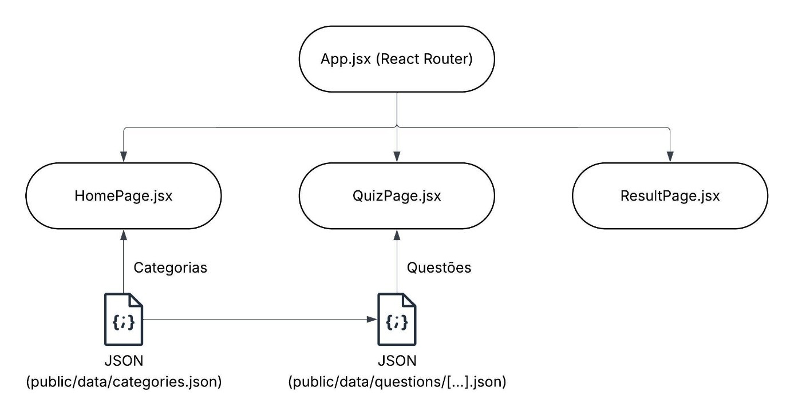

# QUIZELO: O Labirinto do Saber
- Pós-graduação em Desenvolvimento Full Stack
- **Autor:** Severino Vieira Neto
- **Orientador:** Alexandre Agustini
- 2025
- PUCRS

## SUMÁRIO
[1. Contextualização da Proposta](#capitulo-1)  
[2. Objetivos da Construção da Solução](#capitulo-2)  
  [2.1. Aprofundamento nas Tecnologias Centrais do "Modern Web Development Stack"](#capitulo-2-1)  
    [2.1.1. Implementação de uma Aplicação de Página Única](#capitulo-2-1-1)  
    [2.1.2. Utilização o Framework Tailwind](#capitulo-2-1-2)  
    [2.1.3. Utilização o Vite](#capitulo-2-1-3)  
  [2.2. Desenvolvimento de um Produto de Software Completo (end-to-end) com Foco em "Game Design"](#capitulo-2-2)  
    [2.2.1. Implementação da Lógica de um "Game Loop"](#capitulo-2-2-1)  
    [2.2.2. Implementação de um Banco de Dados de Conteúdo JSON](#capitulo-2-2-2)  
[3. Elaboração da Jornada do Usuário](#capitulo-3)  
  [3.1. O Jogador Focado (Seleção de Categoria)](#capitulo-3-1)  
    [3.1.1. Descoberta](#capitulo-3-1-1)  
    [3.1.2. Seleção](#capitulo-3-1-2)  
    [3.1.3. Engajamento](#capitulo-3-1-3)  
    [3.1.4. Feedback](#capitulo-3-1-4)  
    [3.1.5. Resultado](#capitulo-3-1-5)  
  [3.2. O Jogador Casual (Modo Aleatório)](#capitulo-3-2)  
    [3.2.1. Descoberta](#capitulo-3-2-1)  
    [3.2.2. Seleção](#capitulo-3-2-2)  
    [3.2.3. Engajamento](#capitulo-3-2-3)  
    [3.2.4. Feedback](#capitulo-3-2-4)  
    [3.2.5. Resultado](#capitulo-3-2-5)  
[4. Apelo Mercadológico da Solução](#capitulo-4)  
[5. Ciclo de Desenvolvimento da Solução](#capitulo-5)  
[6. Mockup da Proposta de Solução](#capitulo-6)  
[7. Arquitetura de Software](#capitulo-7)  
  [7.1. Diagrama da Arquitetura de Componentes](#capitulo-7-1)  
  [7.2. Modelo de Dados](#capitulo-7-2)  
    [7.2.1. Metadados de Categorias](#capitulo-7-2-1)  
    [7.2.2. Definições de Nível](#capitulo-7-2-2)  
    [7.2.3. Estrutura de Perguntas](#capitulo-7-2-3)  
[8. Validação da Solução](#capitulo-8)  
[9. Registros das Evidências do Projeto](#capitulo-9)  
  [9.1. Repositório do Código-Fonte](#capitulo-9-1)  
  [9.2. Documentação do Projeto](#capitulo-9-2)  
  [9.3. Base de Dados](#capitulo-9-3)  
[10. Considerações Finais e Expectativas](#capitulo-10)  
[Referências](#capitulo-ref)

## <a id="capitulo-1">1. Contextualização da Proposta</a>
A solução proposta se refere ao desenvolvimento de uma aplicação web de perguntas e respostas, comumente conhecida como quiz. Esta solução, desenvolvida como projeto final desta especialização, foi nominada Quizelo.

A escolha deste título é um neologismo derivado da união conceitual das palavras: “Quiz" e “Dédalo”. Na mitologia grega, Dédalo foi um gênio inventor e arquiteto, célebre por sua habilidade de criar autômatos e, mais famosamente, por projetar o Labirinto de Creta — uma estrutura complexa destinada a conter o Minotauro (OVÍDIO, 2017).

O nome Quizelo busca, portanto, evocar a ideia de um labirinto do saber, onde o usuário é desafiado a percorrer por diferentes áreas do conhecimento.

A partir deste ponto, a solução proposta será referida neste documento por seu título.  
O desenvolvimento do Quizelo oriunda da confluência de duas paixões pessoais do autor: a busca por conhecimento e o universo dos jogos digitais.

O autor, um entusiasta do estudo autodidata, possui um profundo interesse por temas de humanidades, notadamente Filosofia, História, Geopolítica e Antropologia, mantendo uma biblioteca pessoal substancial dedicada a esses assuntos. Paralelamente, como um consumidor de jogos digitais, o autor sempre nutriu o desejo de desenvolver seu próprio jogo, unindo o lúdico ao intelectual.

O formato quiz surgiu como a solução ideal para essa fusão. Ele permite a estruturação de um vasto banco de dados de conhecimento – derivado dos próprios interesses e objetos de estudo do autor – dentro de um formato de “game loop” engajador e competitivo.

Em design de jogos, o "game loop" (ou laço de jogo) é definido como a estrutura de interação central que se repete: o jogador age, o jogo fornece uma resposta e o jogador então faz uma nova escolha, criando um ciclo engajador que se repete até a conclusão da rodada (SCHELL, 2011).

A motivação central é, portanto, criar uma plataforma social e intelectualmente desafiadora. O Quizelo não é apenas um projeto para testar o conhecimento do usuário, mas também um local onde amigos e colegas possam disputar esse conhecimento de forma saudável, transformando o ato de estudar e lembrar fatos em uma atividade social divertida. O projeto visa preencher a lacuna entre o estudo solitário e o entretenimento interativo.
## <a id="capitulo-2">2. Objetivos da Construção da Solução</a>
O desenvolvimento do Quizelo foi guiado por três objetivos estratégicos centrais, focados na adição de competências do autor (com mais de uma década de experiência no ambiente back-end, de programação à banco de dados) para o aprofundamento no ecossistema de desenvolvimento front-end moderno.
### <a id="capitulo-2-1">2.1. Aprofundamento nas Tecnologias Centrais do "Modern Web Development Stack"</a>
#### <a id="capitulo-2-1-1">2.1.1. Implementação de uma Aplicação de Página Única</a>
Implementar uma “Single Page Application” (SPA) funcional, gerenciando o estado (componentização e hooks) e o roteamento.
#### <a id="capitulo-2-1-2">2.1.2. Utilização do Framework Tailwind</a>
Aplicar o paradigma “utility-first” do Tailwind CSS para construir uma interface de usuário complexa, responsiva (mobile-first) e visualmente atraente.
#### <a id="capitulo-2-1-3">2.1.3. Utilização do Vite</a>
Configurar o gerenciar um ambiente de desenvolvimento ágil (hot-reload, build) utilizando o Vite.
### <a id="capitulo-2-2">2.2. Desenvolvimento de um Produto de Software Completo (end-to-end) com Foco em "Game Design"</a>
#### <a id="capitulo-2-2-1">2.2.1. Implementação da Lógica de um "Game Loop"</a>
Projetar e implementar a lógica de um “game loop” completo: seleção de categoria, gerenciamento da rodada (10 perguntas), feedback imediato (acerto/erro) e tela de resultados.
#### <a id="capitulo-2-2-2">2.2.2. Implementação de um Banco de Dados de Conteúdo JSON</a>
Estruturar e implementar um banco de dados de conteúdo JSON escalável, otimizado para performance através de “lazy loading” (carregamento sob demanda).
## <a id="capitulo-3">3. Elaboração da Jornada do Usuário</a>
A jornada do usuário no Quizelo foi projetada para ser intuitiva, rápida e cíclica, incentivando a re-jogabilidade.  
A aplicação se baseia em dois casos de uso principais:
### <a id="capitulo-3-1">3.1. O Jogador Focado (Seleção de Categoria)</a>
#### <a id="capitulo-3-1-1">3.1.1. Descoberta</a>
Ao acessar a aplicação, o usuário se depara com a página inicial, onde é exibido um painel com múltiplos cartões. Cada cartão representando uma categoria de conhecimento (exemplo: “História”, “Astrofísica”).
#### <a id="capitulo-3-1-2">3.1.2. Seleção</a>
O usuário seleciona a categoria de seu interesse (exemplo: clica no cartão “Mitologia”).
#### <a id="capitulo-3-1-3">3.1.3. Engajamento</a>
O usuário é levado à tela de quiz. Uma rodada de 10 perguntas, sorteadas aleatoriamente dentro daquela categoria, é iniciada.
#### <a id="capitulo-3-1-4">3.1.4. Feedback</a>
A cada pergunta, o usuário vê uma barra de progresso (exemplo: “1/10”, “2/10”, “3/10”) ser atualizada. Ao responder, ele recebe feedback visual imediato (verde para acerto, vermelho para erro).
#### <a id="capitulo-3-1-5">3.1.5. Resultado</a>
Ao final das 10 perguntas, o usuário é direcionado para uma tela de resultados, onde é apresentado seu desempenho (exemplo: “7/10 acertos”) e um botão para iniciar um novo jogo, sendo redirecionado de volta à página inicial.
### <a id="capitulo-3-2">3.2. O Jogador Casual (Modo Aleatório)</a>
#### <a id="capitulo-3-2-1">3.2.1. Descoberta</a>
Na tela inicial, o usuário visualiza um “Cartão Coringa” de destaque (exemplo: “Desafio Aleatório”).
#### <a id="capitulo-3-2-2">3.2.2. Seleção</a>
O usuário clica nesse cartão.
#### <a id="capitulo-3-2-3">3.2.3. Engajamento</a>
O usuário é levado à tela de quiz. Uma rodada de 10 perguntas é iniciada, onde cada pergunta é sorteada de uma categoria diferente, proporcionando um desafio de conhecimento geral.
#### <a id="capitulo-3-2-4">3.2.4. Feedback</a>
A cada pergunta, o usuário vê uma barra de progresso (exemplo: “1/10”, “2/10”, “3/10”) ser atualizada. Ao responder, ele recebe feedback visual imediato (verde para acerto, vermelho para erro).
#### <a id="capitulo-3-2-5">3.2.5. Resultado</a>
Na tela de resultados, o usuário vê seu desempenho geral (exemplo: “8/10 Acertos”), mas também um resumo detalhado do seu desempenho por categoria (exemplo: “História: 1/1 Acerto”, “Arte: 0/1 Erro”), incentivando-o a explorar suas áreas de maior dificuldade.
## <a id="capitulo-4">4. Apelo Mercadológico da Solução</a>
O mercado de jogos de quiz é um setor robusto e em crescimento. Relatórios de análise de mercado, como os da Statista, indicam que o segmento de jogos assim classificados, movimenta bilhões de dólares globalmente e projeta um crescimento contínuo (STATISTA, 2024).

Este mercado, embora robusto, é dominado por aplicações já consolidadas que atendem a nichos distintos. O Quizelo se posiciona no mercado analisando as seguintes referências:
- **Perguntados:** Originalmente intitulado como Trivia Crack, é o líder no mercado direcionado ao consumidor final. Seu foco está na gamificação social, interface amigável e perguntas geradas pelo usuário. Seu sucesso prova o apelo de mercado para a competição social casual (SENSOR TOWER, 2024).
- **Kahoot!:** O líder no mercado direcionado à negócios e ao setor educacional. Foca no uso em grupo, onde um "host" lidera o jogo. Seu valor de mercado bilionário demonstra a viabilidade comercial de quizzes como ferramentas de aprendizado (KAHOOT!, 2023).
- **New York Times Games:** O líder no mercado em assinaturas. Com jogos como: Trivia, Connections e Wordle, o New York Times Games provou que há um público disposto a pagar por desafios intelectuais de alta qualidade, associados a uma marca confiável (THE NEW YORK TIMES, 2024).

O Quizelo se posiciona como um híbrido: busca a profundidade de conteúdo e a confiabilidade acadêmica do New York Times Games, enquanto oferece a interface amigável e a re-jogabilidade social do Perguntados.

Como público alvo, a proposta visa beneficiar três perfis distintos de usuários:
- **Estudantes e Concurseiros:** Indivíduos que buscam testar seus conhecimentos em áreas específicas como forma de estudo e preparação.
- **Aprendizes Contínuos:** Curiosos, como o próprio autor, que consomem livros e documentários por hobby e desejam uma forma lúdica de validar seu conhecimento.
- **Grupos Sociais:** Amigos e colegas de trabalho que buscam uma atividade de entretenimento intelectual para disputas casuais.

Embora o objetivo inicial seja acadêmico, a arquitetura permite três modelos de negócio futuros:
- **Modelo Premium:** O aplicativo é totalmente gratuito, com receita gerada por anúncios discretos. Uma compra única removeria os anúncios.
- **Modelo de Expansão:** A base de 19 categorias seria gratuita, mas "Pacotes de Desafio" (ex: "Filosofia Grega Antiga", "Segunda Guerra Mundial", "Cinema Cult") poderiam ser vendidos como expansões.
- **Modelo por Licenciamento:** A plataforma poderia ser licenciada para empresas usarem em treinamentos internos ou integração de funcionários.
## <a id="capitulo-5">5. Ciclo de Desenvolvimento da Solução</a>
O ciclo de desenvolvimento do Quizelo segue uma metodologia Ágil, especificamente o Kanban Individual. Como um desenvolvedor único, esta abordagem é ideal por sua ênfase na gestão visual do fluxo de trabalho.

A literatura sobre produtividade ágil defende que a eficiência do Kanban deriva de dois princípios simples: (1) visualizar o trabalho e (2) limitar o trabalho em progresso. Esta abordagem visual permite um rastreamento de progresso claro e a identificação imediata de gargalos, tornando-se uma ferramenta eficiente para o gerenciamento de tarefas individuais (BENSON; DEMARIA BARRY, 2011).
O ciclo do projeto foi dividido em quatro fases, que estão descritas abaixo:
- **Etapa 1 (Concepção e Conteúdo):** Esta etapa inicial definiu o escopo, o público-alvo, o nome da solução proposta e a identidade visual. O principal entregável desta fase foi a criação e curadoria de um banco de dados com mais de mil perguntas e a padronização de suas fontes. Para esta etapa, o autor atuou como especialista de domínio e curador, definindo as categorias, os níveis de dificuldade e os requisitos de formatação, além de desenvolver a maior parte das perguntas. A geração textual das demais perguntas foram realizadas com o auxílio da ferramenta de inteligência artificial generativa Google Gemini (GEMINI, 2025), sob a supervisão direta e validação rigorosa do autor. Todo o conteúdo foi, por fim, revisado e aprovado pelo autor antes da integração.
- **Fase 2 (Prototipagem e Arquitetura):** Esta etapa focou no design técnico da solução. O desenvolvimento dos mockups visuais (dispostos no capítulo 6 deste documento), a definição da arquitetura de software (disposta no capítulo 7 desde documento) e a configuração do ambiente de desenvolvimento.
- **Fase 3 (Desenvolvimento):** Esta é a etapa de codificação principal, gerenciada pelo Kanban. As tarefas foram agrupadas nas seguintes etapas:
  - **Etapa 1:** Renderização da página inicial e implementação das rotas de navegação.
  - **Etapa 2:** Implementação da lógica da página do quiz para o primeiro caso de uso, incluindo o carregamento sob demanda das perguntas.
  - **Etapa 3:** Implementação da página de resultado e da passagem de estado entre as telas.
  - **Etapa 4:** Implementação do “Desafio Aleatório”, referente ao segundo caso de uso, com a lógica para buscar perguntas em arquivos diferentes.
  - **Etapa 5:** Refatoração e estilização final através do Tailwind CSS.
- **Fase 4 (Validação e Lançamento):** Implementação das estratégias de teste (descritas no capítulo 8 deste documento) e geração da versão oficial.

Para o controle de versão, foi utilizado o Git hospedado no GitHub (cujo procedimento está descrito no capítulo 9 deste documento) e para a estratégia de ramificação, foi adotado o Trunk-Based Development, que é mais ágil e direto, focado em uma única branch principal.

O fluxo foi gerenciado da seguinte forma:
- **Branch main (Tronco Único):** Todo o desenvolvimento ocorreu diretamente na branch main. Esta branch contém sempre a versão mais recente do código, que pode estar em desenvolvimento ativo.
- **Commits de Desenvolvimento:** O progresso diário foi salvo através de commits atômicos na main.
- **Versionamento:** Com a conclusão e validação do Quizelo (Fase 4), o commit específico na main que representa essa versão estável recebeu uma tag de versionamento com o seguinte número: 1.0.0.
- **GitHub Releases:** A partir desta tag, foi gerada uma "Release" oficial na plataforma do GitHub que está especificada no capítulo 10 deste documento.

Esta abordagem garantiu que as versões oficiais em produção fossem marcos estáveis e imutáveis, separadas do trabalho em desenvolvimento, ao mesmo tempo em que manteve a simplicidade de uma única branch para o desenvolvedor.
## <a id="capitulo-6">6. Mockup da Proposta de Solução</a>
Conforme a descrição da jornada do usuário, descrita no capítulo 3 deste documento, e os objetivos da arquitetura, descritos no capítulo 7 deste documento, esta seção apresenta os protótipos que ilustram a interface da solução.

As imagens a seguir são mockups de baixa fidelidade cujo objetivo, é apresentar esboços conceituais que serviram como guia visual para a arquitetura da informação, para o fluxo de navegação e a disposição dos componentes centrais da aplicação.

Para a elaboração destas ilustrações, foi utilizado a ferramenta de inteligência artificial generativa Google Gemini para converter os conceitos de design e os fluxos de tela descritos em imagens conceituais.  
A imagem abaixo ilustra a página inicial (descrita nos casos de uso 1 de 2, no capítulo 3 deste documento), onde o usuário é recebido e pode selecionar uma das 19 categorias ou optar pelo “Desafio Aleatório”.

Figura 6.1: Mockup da página inicial  
  
Fonte: Elaborado pelo autor (2025).

A imagem abaixo ilustra a página do quiz, validando os requisitos visuais da jornada do usuário, como a barra de progresso e o feedback imediato de acertos e erros, assim como um botão para a próxima pergunta.  

Figura 6.2: Mockup da página do quiz  
  
Fonte: Elaborado pelo autor (2025).

A imagem abaixo ilustra a página de resultado, atendendo ao requisito de apresentar um resumo do desempenho geral e o detalhamento da performance por categoria, fechando o ciclo de feedback para o usuário.

Figura 6.3: Mockup da página de resultado  
  
Fonte: Elaborado pelo autor (2025).
## <a id="capitulo-7">7. Arquitetura de Software</a>
O Quizelo foi projetado como uma Single Page Application (SPA). Esta arquitetura é definida por carregar a estrutura principal da aplicação uma única vez.

A partir desse ponto, as navegações subsequentes não recarregam a página inteira; em vez disso, apenas os dados necessários são buscados dinamicamente. Esta abordagem garante uma experiência de usuário mais rápida e fluida, similar à de um aplicativo nativo (MDN WEB DOCS, 2025).

O arcabouço tecnológico está listado abaixo:
- Front-end: React
- Build Tool: Vite
- Estilização: Tailwind CSS
- Roteamento: React Router DOM
### <a id="capitulo-7-1">7.1. Diagrama da Arquitetura de Componentes</a>
A arquitetura segue o modelo "Component-Based", separando a lógica em dois diretórios principais: Pages (componentes de tela que gerenciam a lógica de negócio) e Components (componentes reutilizáveis que apenas exibem dados).

O diagrama a seguir, desenvolvido através do aplicativo web Lucidchart, apresenta o fluxo de dados e a hierarquia dos componentes.

Figura 7.1: Diagrama da arquitetura de componentes  
  
Fonte: Elaborado pelo autor (2025).

O fluxo de integração é controlado pelo App.jsx, que utiliza o react-router-dom para renderizar uma das três páginas principais:
- **HomePage.jsx:** Esta página busca os metadados das categorias (disponíveis através do caminho: public/data/categories.json) para renderizar os cartões de seleção.
- **QuizPage.jsx:** Este é o componente central. Ele usa o Hook: useParams para identificar qual categoria foi selecionada (exemplo: “HIST” ou “Random”). Com base nesse ID, ele executa a lógica do carregamento sob demanda, buscando os arquivos JSON de perguntas relevantes da pasta: public/data/questions/. Ele gerencia o estado da rodada (pergunta atual, pontuação) e, ao final, navega para a ResultPage.jsx.
- **ResultPage.jsx:** Esta página recebe os dados da rodada concluída através do hook: useLocation e exibe o resumo do desempenho.
### <a id="capitulo-7-2">7.2. Modelo de Dados</a>
A performance do Quizelo depende de um modelo de dados desacoplado e estático, servido mediante arquivos JSON. Esta abordagem elimina a necessidade de um banco de dados de back-end, ao mesmo tempo em que simula uma chamada de API assíncrona.

O conteúdo desta base de dados (1140 perguntas) foi gerador pelo autor, que atuou como curador e editor, utilizando o modelo de IA Google Gemini como ferramenta assistiva para pesquisa e redação inicial (GEMINI, 2025).

O modelo é dividido em três esquemas principais:
#### <a id="capitulo-7-2-1">7.2.1. Metadados de Categorias</a>
O arquivo: categories.json, é o índice da aplicação. Seu carregamento é realizado uma única vez através da: HomePage.jsx, para construir a interface de seleção.

O quadro abaixo exemplica seu conteúdo:
```javascript
// Esquema para um objeto no array ‘categories.json’
{
  “id”: “FILO”, // String (ID único de 4 letras, usando como chave)
  “name”: “Filosofia”, // String (Nome de exibição)
  “description”: “...” // String (Descrição para o cartão)
}
```
#### <a id="capitulo-7-2-2">7.2.2. Definições de Nível</a>
Este é o objeto constante (localizado em: src/constants/levels.json) que mapeia os identificadores de dificuldade (easy, médium, hard) para suas descrições completas.

O quadro abaixo exemplica seu conteúdo:
```javascript
// Esquema para o objeto ‘DIFFICULTY_LEVELS’
{
  “easy”: {
    “label”: “Fácil”, // String (rótulo curto)
    “description”: “Os Fundamentos...” // String (descrição completa)
  },
  “medium”: { ... }, 
  “hard”: { ... }
}
```
#### <a id="capitulo-7-2-3">7.2.3. Estrutura de Perguntas</a>
Este é o esquema principal do banco de dados, replicado em 19 arquivos JSON (exemplo: filosofia.json). Cada arquivo contém um array de 60 objetos de perguntas.

O quadro abaixo exemplifica seu conteúdo:
```javascript
// Esquema para um objeto de pergunta
{
  “id”: “FILO041”, // ID único da pergunta
  “category”: “Filosofia”, // Categoria mãe
  “level”: “hard”, // Chave para 'levels.js': "easy", "medium", ou "hard"
  “question”: “”, // O texto da pergunta
  “Options”: [ // Array (Sempre 4 objetos de opção)
    {
      “description”: “Porque provam que...”, // Texto da opção A
      “isCorrect”: false // Boolean (Flag da resposta)
    },
    {
      “description”: “Porque demonstram como...”,
      “isCorrect”: true
    },
    { ... },
    { ... }
  ],
  “source_explanation”: “Na Introdução da obra...”, // Explicação casual
  “source_abnt”: “KANT, Immanuel. Crítica da Razão Pura...” // Fonte ABNT
}
```
## <a id="capitulo-8">8. Validação da Solução</a>
A garantia de qualidade do Quizelo foi assegurada por uma estratégia de validação em três etapas, que estão descritos abaixo:
- **Etapa 1: Validação do Conteúdo:** A estratégia mais crítica foi a validação do banco de perguntas.
  - **Curadoria:** Cada pergunta foi criada e revisada pelo autor.
  - **Verificação de Fontes:** Cada pergunta (incluindo as opções) foi validada contra fontes primária ou institucionais.
  - **Padronização ABNT:** Em cada pergunta, suas respectivas fontes foram formatadas no padrão ABNT para garantir rigor acadêmico e convergir com a proposta de solução.
- **Etapa 2: Validação da Lógica:** Foi utilizada a biblioteca: React Testing Library para focar nos testes de comportamento.
  -	**Testes Unitários:** Validar as funções de embaralhamento, para garantir que ela retorna o número correto de itens e em ordem aleatória.
- **Etapa 3: Validação de Usabilidade:**
  - **Testes Manuais:** O fluxo de usuário (casos de uso 1 e 2 descritos no capítulo 3 deste documento) foi testado manualmente pelo autor e por um grupo de controle (amigos e colegas de trabalho, como motivado no capítulo 1 deste documento). 
## <a id="capitulo-9">9. Registros das Evidências do Projeto</a>
Todo o trabalho de desenvolvimento e documentação da solução foi centralizado no Git, um sistema de controle de versões, e está publicamente disponível.  
Este capítulo registra os artefatos técnicos produzidos: o repositório do código-fonte, a documentação de uso e a base de dados de conteúdo.
### <a id="capitulo-9-1">9.1. Repositório do Código-Fonte</a>
O código-fonte completo da aplicação está hospedado na plataforma GitHub.

Seguindo a estratégia de versionamento, descrita no capítulo 5 deste documento, a branch main representa o estado de desenvolvimento mais atual. As versões estáveis estão marcadas como “Releases” (associadas a tags de versão, como: 1.0.0 por exemplo) para fácil identificação.
- URL do Repositório: https://github.com/severinovieiraneto/quizelo.git
### <a id="capitulo-9-2">9.2. Documentação do Projeto</a>
A documentação do projeto foi elaborada especificamente para a solução e está localizada na raiz do repositório, no arquivo README.md.
### <a id="capitulo-9-3">9.3. Base de Dados</a>
O principal artefato de conteúdo do projeto – o banco de dados de 1140 perguntas e suas respectivas fontes formatadas no padrão ABNT – também está versionado.

Estas evidências de conteúdo podem ser encontradas no repositório no seguinte diretório:
-  Localização dos Dados: https://github.com/severinovieiraneto/quizelo/tree/main/data/questions 
## <a id="capitulo-10">10. Considerações Finais e Expectativas</a>
A trajetória nesta especialização representou um ponto de inflexão na carreira do autor. Vindo de uma década de experiência consolidada em desenvolvimento back-end, a interação com o ecossistema de front-end moderno era, até então, limitada e superficial. O curso forneceu a base teórica necessária sobre arquitetura de software, metodologias ágeis e o funcionamento de stacks modernas, que antes eram uma incógnita.

O desenvolvimento do Quizelo foi o catalisador para solidificar essa teoria. O desafio (como detalhado no capítulo 2 deste documento) era claro: traduzir a lógica de programação de back-end do autor para o paradigma declarativo e reativo do React. A dificuldade inicial não estava no que fazer, mas em como fazer da "maneira React" – a gestão de estado, o ciclo de vida do componente e a configuração do ambiente (Vite, Tailwind).

Este projeto cumpriu integralmente seus objetivos. Foi concluído não apenas o desenvolvimento de uma aplicação funcional, mas também o aprofundamento de conhecimento no stack proposto. A arquitetura de carregamento sob demanda das perguntas, por exemplo, foi uma solução de performance que exigiu a aplicação direta dos conceitos de fetch assíncrono e useEffect. A utilização do Tailwind CSS provou ser um acelerador massivo, permitindo um foco na lógica do componente sem sacrificar a qualidade visual.  
Como expectativas futuras, esta formação qualifica o autor para atuar de forma muito mais completa como um desenvolvedor full-stack. A capacidade de não apenas construir a API (back-end), mas também de prototipar e desenvolver a interface de usuário (front-end) com ferramentas modernas é um diferencial de mercado inestimável.

Além das expectativas profissionais do autor, o Quizelo foi arquitetado com a escalabilidade em mente, permitindo que o projeto evolua de um MVP acadêmico para uma plataforma de social de quiz completa.  
Como expectativas futuras para a solução, o próximo passo lógico é a implementação de um sistema de autenticação de usuários. Isso permitiria que o histórico de jogos e o desempenho individual fossem registrados, viabilizando duas funcionalidades de alto engajamento: a exibição de um ranking global de pontuações e opções de compartilhamento de resultados em redes sociais. Vislumbra-se, também, a otimização do pipeline de conteúdo através da integração com APIs de IA Generativa (como Google Gemini ou OpenAI ChatGPT) para a geração automática de perguntas, movendo o papel do autor de "criador de conteúdo" para "curador e verificador". Finalmente, a arquitetura pode ser expandida para incluir modos de jogo multiplayer simultâneos, transformando a disputa assíncrona em um evento online em tempo real.
## <a id="capitulo-ref">Referências</a>
OVÍDIO. Metamorfoses. Tradução de Raimundo M. M. R. e Silva. São Paulo: Editora 34, 2017.

SCHELL, Jesse. A Arte do Game Design: o livro das lentes. 2. ed. Tradução de Giácomo Figueredo. São Paulo: Blucher, 2011.

KAHOOT!. Kahoot! ASA announces fourth quarter and full year 2023 financial results. [Press Release]. Oslo: Kahoot!, 29 fev. 2024. Disponível em: https://kahoot.com/investor/news/kahoot-asa-announces-fourth-quarter-and-full-year-2023-financial-results/. Acesso em: 7 nov. 2025.

SENSOR TOWER. Top Trivia Apps Worldwide for 2023. São Francisco: Sensor Tower, 2024. Disponível em: https://sensortower.com/blog/top-trivia-apps-2023. Acesso em: 7 nov. 2025.

STATISTA. Mobile trivia games market size worldwide from 2023 to 2030. Hamburgo: Statista, 2024. Disponível em: https://www.statista.com/statistics/1381313/mobile-trivia-games-market-size-worldwide/. Acesso em: 7 nov. 2025.

THE NEW YORK TIMES COMPANY. The New York Times Company Reports First-Quarter 2024 Results. [Press Release]. Nova York: The New York Times, 8 maio 2024. Disponível em: https://investors.nytco.com/news-and-events/press-releases/press-release-details/2024/The-New-York-Times-Company-Reports-First-Quarter-2024-Results/. Acesso em: 7 nov. 2025.

BENSON, Jim; DEMARIA BARRY, Tonianne. Personal Kanban: Mapping Work | Navigating Life. Seattle: Modus Cooperandi Press, 2011.

MDN WEB DOCS. Single-page application (SPA). [S.l.]: Mozilla, 2025. Disponível em: https://developer.mozilla.org/en-US/docs/Glossary/SPA. Acesso em: 7 nov. 2025.

VIEIRA NETO, Severino. Quizelo: O Labirinto do Saber. Versão 1.0.0. [S.I.]: GitHub, 2025. Repositório de software. Disponível em: https://github.com/severinovieiraneto/quizelo.git. Acesso em: 7 nov. 2025.

GEMINI. Modelo de linguagem grande. Mountain View, CA: Google, 2025. Disponível em: https://gemini.google.com/. Acesso em: 7 nov. 2025.